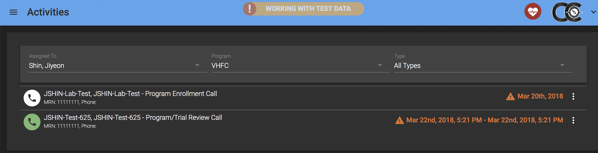
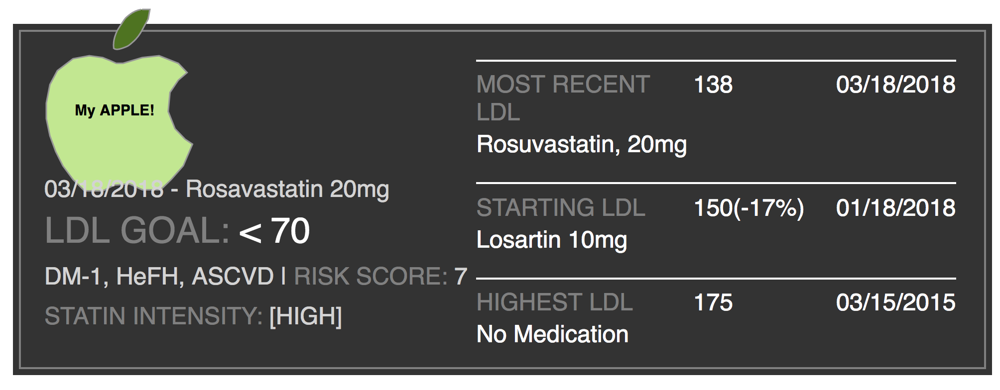
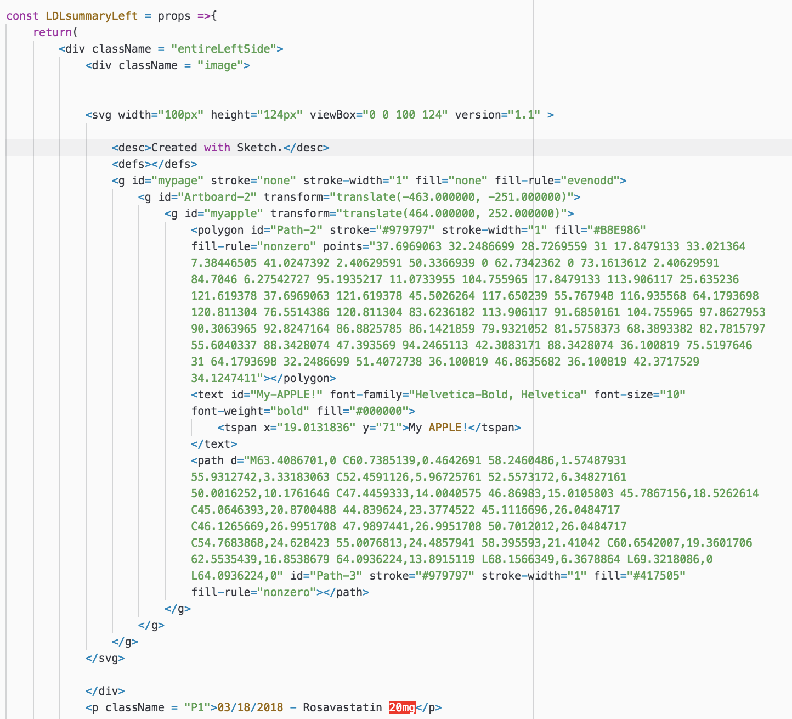

# grockbox-mockup
created for sketch tutorial given to developers at Partners Healthcare- made mock cardiocompass module for the demo.  This is to show developers at Partners how to insert vector images they created in sketch into their react code.

For the pursposes of the demo, tried to make a module similar to what is being created in the company - copied this kind of layout in about a day:

made this, inserted image using SVG

SVG insertion:

Troubleshootiing:

If you have trouble inserting your sketch image into the code, know that sometimes sketch includes excess info at the beginning of what you're trying to insert, try removing it and/or look at the above example of what should be included in the beginning of the image code.
